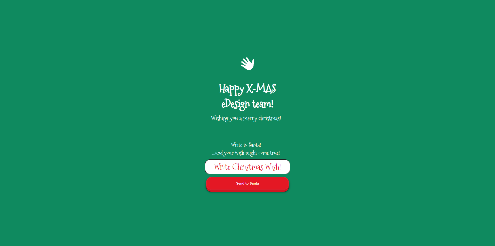
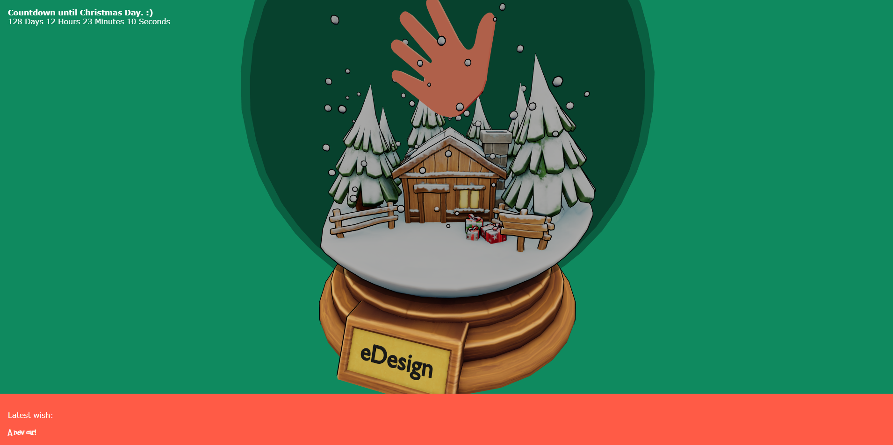
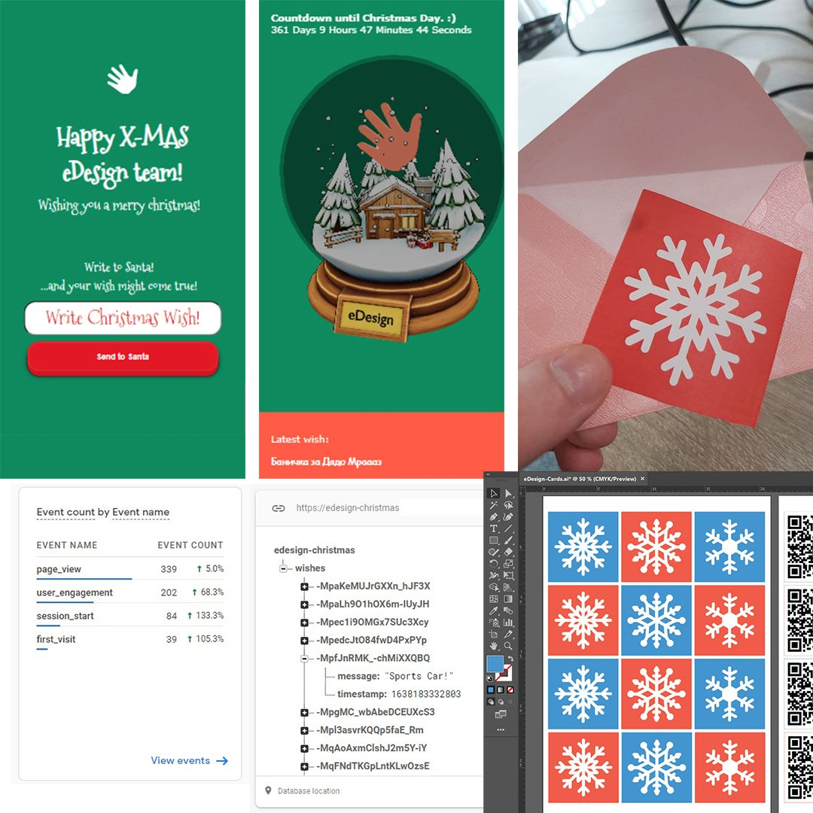

#
I made a very simple card with a three.js scene which holds a custom made 3d model of a snowglobe. At first the user is presented with a home screen form in which they can write their christmas wishes! Afterwards I store those wishes in a firebase database in order to callback the previous wish and display it to the current visitor.

After the site was finished, I printed a few cards with a QR code on the back and gave them out to my colleagues.

>[Christmas Card Link](https://gekolev.github.io/edesign-christmas/)

