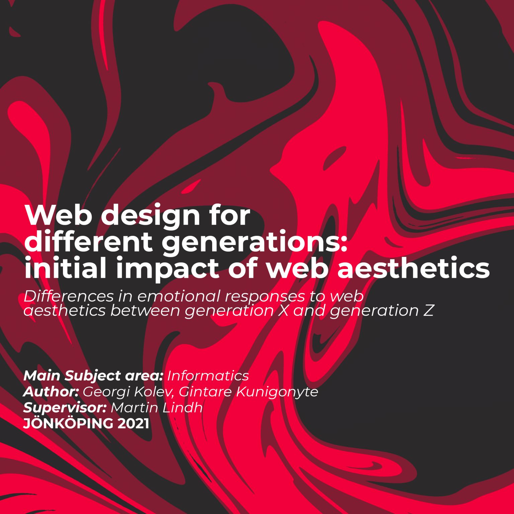

## Web design for different generations: initial impact of web aesthetics

#### Differences in emotional responses to web aesthetics between Generation X and Generation Z

As the digital age matures, we seek to understand the Generation X and Generation Z, and their visual perception and emotional responses to the different dimensions of online aesthetics - classical and expressive. The development of digital products and environments with a specific user experience in mind is beneficial for creating the most suitable outcome. Emotional responses to the different aesthetics can have an impact on consumers' behaviour as well as on their opinion and the image of the digital content presented. Previous research has proven that age has an impact on visual perception and online experience, but little is known about differences in needs and approaches between the important web user groups of Generation X and Generation Z when presented with a web interface. Our research focuses on their emotional responses and initial reactions towards website interfaces that have been influenced by a specific aesthetic style and seeks to find observations to improve the online experience of these two generations.

[Thesis](https://drive.google.com/file/d/1LgFRte0RF_IqsgYnoEPG0JhhDaYKyMSm/view)

